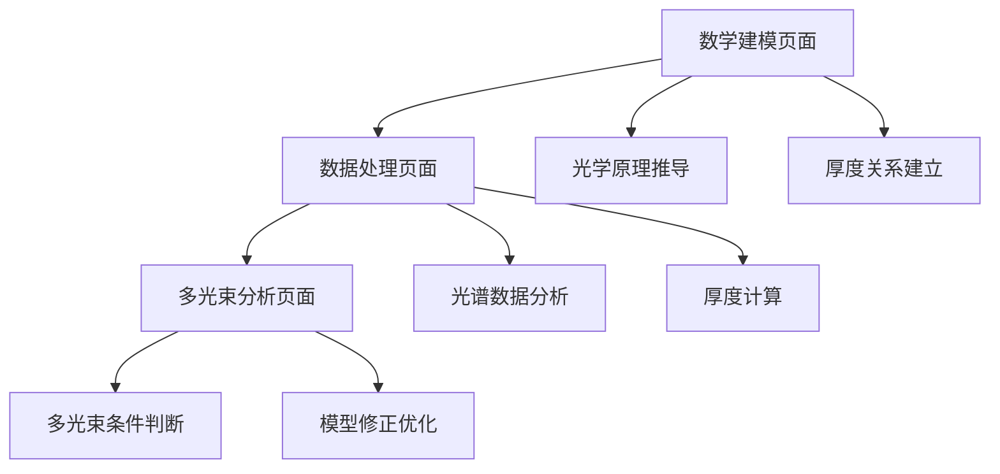

# 红外干涉法碳化硅外延层厚度测量 - 产品需求文档

## 1. 产品概述

本项目旨在建立基于红外干涉法的碳化硅（SiC）外延层厚度精确测量系统，通过光学干涉原理和菲涅尔公式推导数学模型，实现无损、高效的外延层厚度确定。

项目解决SiC功率器件制造中外延层厚度精确控制的关键技术问题，为新能源汽车、智能电网等领域的高性能功率半导体器件提供核心工艺参数测量方案。

该系统具有重要的产业应用价值，可显著提升SiC器件制造的良品率和生产效率，降低生产成本。

## 2. 核心功能

### 2.1 用户角色

| 角色 | 使用方式 | 核心权限 |
|------|----------|----------|
| 工艺工程师 | 直接操作测量系统 | 执行测量、查看结果、调整参数 |
| 质量工程师 | 数据分析和验证 | 查看测量数据、分析可靠性、生成报告 |
| 研发工程师 | 模型优化和算法改进 | 修改算法、优化模型、系统维护 |

### 2.2 功能模块

本系统包含以下核心页面：
1. **数学建模页面**：光学干涉原理推导、菲涅尔公式应用、相位差计算
2. **数据处理页面**：光谱数据导入、干涉条纹分析、厚度计算算法
3. **多光束分析页面**：多光束干涉条件判断、精度影响评估、模型修正

### 2.3 页面详情

| 页面名称 | 模块名称 | 功能描述 |
|----------|----------|----------|
| 数学建模页面 | 光学原理模块 | 基于光的干涉原理和菲涅尔公式推导反射光相位差公式 |
| 数学建模页面 | 厚度关系模块 | 建立光反射路径与外延层厚度的数学关系式 |
| 数据处理页面 | 数据导入模块 | 导入附件1、2的碳化硅晶圆片光谱实测数据（10°和15°入射角） |
| 数据处理页面 | 算法计算模块 | 执行厚度确定算法，计算外延层厚度值 |
| 数据处理页面 | 可靠性分析模块 | 分析计算结果的准确性和可靠性 |
| 多光束分析页面 | 条件判断模块 | 推导多光束干涉的必要条件 |
| 多光束分析页面 | 硅片分析模块 | 分析附件3、4的硅晶圆片测试结果 |
| 多光束分析页面 | 模型修正模块 | 建立多光束干涉下的数学模型和算法 |

## 3. 核心流程

### 主要操作流程

**问题一流程**：建立数学模型 → 推导菲涅尔公式 → 计算相位差 → 建立厚度关系式

**问题二流程**：导入光谱数据 → 应用数学模型 → 执行厚度算法 → 分析结果可靠性

**问题三流程**：推导多光束条件 → 分析硅片数据 → 判断干涉类型 → 修正计算模型

## 4. 用户界面设计

### 4.1 设计风格

- **主色调**：深蓝色（#1E3A8A）和科技蓝（#3B82F6）
- **辅助色**：灰白色（#F8FAFC）和警告橙（#F59E0B）
- **按钮样式**：圆角矩形，3D阴影效果
- **字体**：主标题使用18px粗体，正文使用14px常规字体
- **布局风格**：卡片式布局，顶部导航栏
- **图标风格**：线性图标，科技感设计

### 4.2 页面设计概览

| 页面名称 | 模块名称 | UI元素 |
|----------|----------|--------|
| 数学建模页面 | 公式展示区 | LaTeX公式渲染，白色背景卡片，蓝色边框 |
| 数学建模页面 | 参数输入区 | 输入框组件，实时验证，错误提示红色 |
| 数据处理页面 | 数据上传区 | 拖拽上传组件，进度条显示，绿色成功提示 |
| 数据处理页面 | 结果展示区 | 表格和图表组合，响应式布局 |
| 多光束分析页面 | 条件判断区 | 逻辑流程图，交互式节点 |
| 多光束分析页面 | 对比分析区 | 双栏对比布局，差异高亮显示 |

### 4.3 响应式设计

系统采用桌面优先设计，支持平板和移动端自适应，考虑触摸交互优化，确保在不同设备上的良好用户体验。