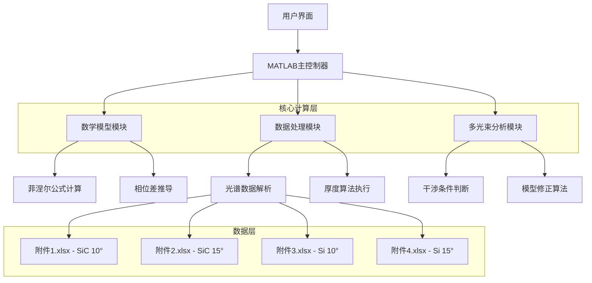
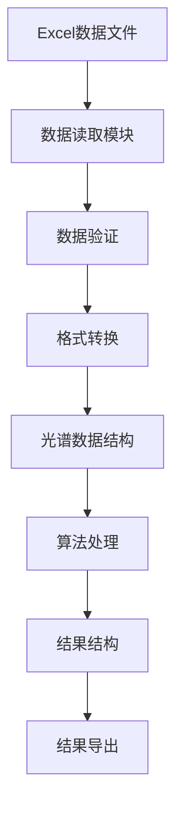

# 红外干涉法碳化硅外延层厚度测量 - 技术架构文档

## 1. 架构设计



## 2. 技术描述

- **主要平台**：MATLAB R2020b+
- **核心工具箱**：Signal Processing Toolbox, Curve Fitting Toolbox
- **数据格式**：Excel (.xlsx), MAT文件
- **可视化**：MATLAB绘图函数，LaTeX公式渲染

## 3. MATLAB项目结构树

```
CUMCU_B_Project/
├── main.m                          % 主程序入口
├── config/
│   ├── constants.m                 % 物理常数定义
│   └── parameters.m                % 系统参数配置
├── models/
│   ├── problem1/
│   │   ├── fresnel_formula.m       % 菲涅尔公式实现
│   │   ├── phase_difference.m      % 相位差计算
│   │   └── thickness_relation.m    % 厚度关系推导
│   ├── problem2/
│   │   ├── thickness_algorithm.m   % 厚度确定算法
│   │   ├── reliability_analysis.m  % 可靠性分析
│   │   └── sic_data_processor.m    % SiC数据处理
│   └── problem3/
│       ├── multi_beam_conditions.m % 多光束干涉条件
│       ├── si_data_analyzer.m      % 硅片数据分析
│       └── model_correction.m      % 模型修正算法
├── utils/
│   ├── data_loader.m               % 数据加载工具
│   ├── excel_reader.m              % Excel文件读取
│   ├── plot_spectrum.m             % 光谱绘图
│   └── export_results.m            % 结果导出
├── data/
│   ├── data/
│   ├── 附件1.xlsx                  % SiC晶圆片10°入射角数据
│   ├── 附件2.xlsx                  % SiC晶圆片15°入射角数据
│   ├── 附件3.xlsx                  % Si晶圆片10°入射角数据
│   ├── 附件4.xlsx                  % Si晶圆片15°入射角数据
│   └── README.md                   % 数据说明文档
│   └── processed/                  % 处理后数据
├── results/
│   ├── problem1_results.mat        % 问题1结果
│   ├── problem2_results.mat        % 问题2结果
│   └── problem3_results.mat        % 问题3结果
├── tests/
│   ├── test_fresnel.m              % 菲涅尔公式测试
│   ├── test_thickness_calc.m       % 厚度计算测试
│   └── test_multi_beam.m           % 多光束分析测试
└── docs/
    ├── mathematical_derivation.pdf  % 数学推导文档
    └── algorithm_specification.pdf  % 算法规范文档
```

## 4. 核心算法定义

### 4.1 问题一：数学模型建立

**菲涅尔公式模块** (`fresnel_formula.m`)
```matlab
function [r_s, r_p, t_s, t_p] = fresnel_formula(n1, n2, theta_i)
% 输入参数：
% n1 - 入射介质折射率
% n2 - 透射介质折射率  
% theta_i - 入射角（弧度）
% 输出参数：
% r_s, r_p - s偏振和p偏振反射系数
% t_s, t_p - s偏振和p偏振透射系数
end
```

**相位差计算模块** (`phase_difference.m`)
```matlab
function delta = phase_difference(thickness, n_epi, lambda, theta_i)
% 输入参数：
% thickness - 外延层厚度（μm）
% n_epi - 外延层折射率
% lambda - 波长（nm）
% theta_i - 入射角（度）
% 输出参数：
% delta - 相位差（弧度）
end
```

### 4.2 问题二：厚度确定算法

**厚度算法模块** (`thickness_algorithm.m`)
```matlab
function thickness = thickness_algorithm(wavenumber, reflectance, angle, n_epi)
% 输入参数：
% wavenumber - 波数数组（cm^-1）
% reflectance - 反射率数组（%）
% angle - 入射角（度）
% n_epi - 外延层折射率
% 输出参数：
% thickness - 计算得到的厚度（μm）
end
```

### 4.3 问题三：多光束干涉分析

**多光束条件判断** (`multi_beam_conditions.m`)
```matlab
function is_multi_beam = multi_beam_conditions(reflectance_data, threshold)
% 输入参数：
% reflectance_data - 反射率数据
% threshold - 判断阈值
% 输出参数：
% is_multi_beam - 是否存在多光束干涉（逻辑值）
end
```

## 5. 数据模型

### 5.1 数据结构定义

**光谱数据结构**
```matlab
struct SpectrumData
    wavenumber      % 波数数组 (cm^-1)
    reflectance     % 反射率数组 (%)
    incident_angle  % 入射角 (度)
    material        % 材料类型 ('SiC' 或 'Si')
    filename        % 数据文件名
end
```

**计算结果结构**
```matlab
struct ThicknessResult
    thickness       % 计算厚度 (μm)
    reliability     % 可靠性指标
    method          % 计算方法
    parameters      % 计算参数
    timestamp       % 计算时间戳
end
```

### 5.2 数据处理流程



## 6. 关键数学公式实现

### 6.1 菲涅尔反射系数

```latex
r_s = \frac{n_1\cos\theta_i - n_2\cos\theta_t}{n_1\cos\theta_i + n_2\cos\theta_t}
```

```latex
r_p = \frac{n_2\cos\theta_i - n_1\cos\theta_t}{n_2\cos\theta_i + n_1\cos\theta_t}
```

### 6.2 相位差公式

```latex
\delta = \frac{4\pi n_{epi} d \cos\theta_t}{\lambda} + \phi_1 - \phi_2
```

### 6.3 厚度计算公式

```latex
d = \frac{(P_i - 0.5) \times 0.001 \times \lambda_i}{\sqrt{n_1^2 - \sin^2\theta_1}}
```

其中：
- $P_i$ - 第i个极值对应的级数
- $\lambda_i$ - 第i个极值处的波长（nm）
- $n_1$ - 外延层折射率（SiC为2.55）
- $\theta_1$ - 入射角（度）

## 7. 性能优化策略

- **向量化计算**：使用MATLAB向量化操作提高计算效率
- **并行处理**：对多个数据文件采用并行计算
- **内存管理**：优化大数据集的内存使用
- **算法优化**：采用快速傅里叶变换等高效算法